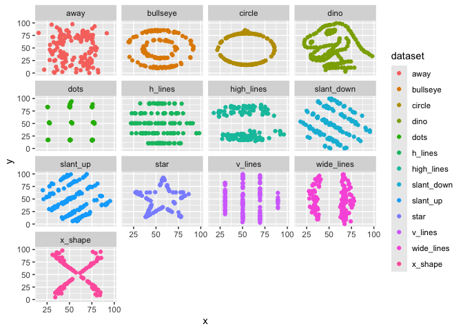
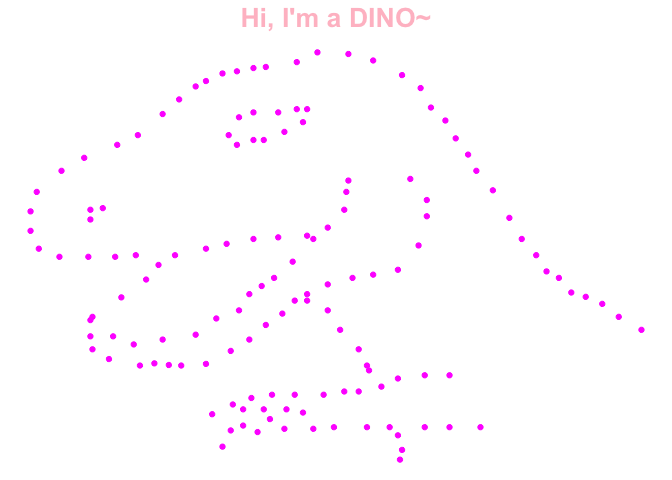

Lab1
================
Tiana
2024-09-05

# Load Packages

``` r
library(haven)
library(dplyr)
```

    ## 
    ## Attaching package: 'dplyr'

    ## The following objects are masked from 'package:stats':
    ## 
    ##     filter, lag

    ## The following objects are masked from 'package:base':
    ## 
    ##     intersect, setdiff, setequal, union

``` r
library(tidyr)
library(ggplot2)
library(ggstatsplot)
```

    ## You can cite this package as:
    ##      Patil, I. (2021). Visualizations with statistical details: The 'ggstatsplot' approach.
    ##      Journal of Open Source Software, 6(61), 3167, doi:10.21105/joss.03167

``` r
library(psych)
```

    ## 
    ## Attaching package: 'psych'

    ## The following objects are masked from 'package:ggplot2':
    ## 
    ##     %+%, alpha

``` r
library(bruceR)
```

    ## 
    ## bruceR (v2024.6)
    ## Broadly Useful Convenient and Efficient R functions
    ## 
    ## Packages also loaded:
    ## ✔ data.table ✔ emmeans
    ## ✔ dplyr      ✔ lmerTest
    ## ✔ tidyr      ✔ effectsize
    ## ✔ stringr    ✔ performance
    ## ✔ ggplot2    ✔ interactions
    ## 
    ## Main functions of `bruceR`:
    ## cc()             Describe()  TTEST()
    ## add()            Freq()      MANOVA()
    ## .mean()          Corr()      EMMEANS()
    ## set.wd()         Alpha()     PROCESS()
    ## import()         EFA()       model_summary()
    ## print_table()    CFA()       lavaan_summary()
    ## 
    ## For full functionality, please install all dependencies:
    ## install.packages("bruceR", dep=TRUE)
    ## 
    ## Online documentation:
    ## https://psychbruce.github.io/bruceR
    ## 
    ## To use this package in publications, please cite:
    ## Bao, H.-W.-S. (2024). bruceR: Broadly useful convenient and efficient R functions (Version 2024.6) [Computer software]. https://CRAN.R-project.org/package=bruceR

    ## 
    ## These packages are dependencies of `bruceR` but not installed:
    ## - pacman, openxlsx, ggtext, see, lmtest, vars, phia, MuMIn, GGally
    ## 
    ## ***** Install all dependencies *****
    ## install.packages("bruceR", dep=TRUE)

``` r
library(ggsci)
library(datasauRus)
```

# First look of descriptive statistics

``` r
datasaurus_dozen %>% 
  group_by(dataset) %>%
  dplyr::summarize(mean_x    = mean(x),
      mean_y    = mean(y),
      std_dev_x = sd(x),
      std_dev_y = sd(y),
      corr_x_y  = cor(x, y)
    )
```

    ## # A tibble: 13 × 6
    ##    dataset    mean_x mean_y std_dev_x std_dev_y corr_x_y
    ##    <chr>       <dbl>  <dbl>     <dbl>     <dbl>    <dbl>
    ##  1 away         54.3   47.8      16.8      26.9  -0.0641
    ##  2 bullseye     54.3   47.8      16.8      26.9  -0.0686
    ##  3 circle       54.3   47.8      16.8      26.9  -0.0683
    ##  4 dino         54.3   47.8      16.8      26.9  -0.0645
    ##  5 dots         54.3   47.8      16.8      26.9  -0.0603
    ##  6 h_lines      54.3   47.8      16.8      26.9  -0.0617
    ##  7 high_lines   54.3   47.8      16.8      26.9  -0.0685
    ##  8 slant_down   54.3   47.8      16.8      26.9  -0.0690
    ##  9 slant_up     54.3   47.8      16.8      26.9  -0.0686
    ## 10 star         54.3   47.8      16.8      26.9  -0.0630
    ## 11 v_lines      54.3   47.8      16.8      26.9  -0.0694
    ## 12 wide_lines   54.3   47.8      16.8      26.9  -0.0666
    ## 13 x_shape      54.3   47.8      16.8      26.9  -0.0656

# Introduce GGplot

``` r
ggplot(datasaurus_dozen, aes(x = x, y = y, colour = dataset))+
    geom_point()+ facet_wrap(~dataset)
```

<!-- -->

``` r
dino<- datasaurus_dozen %>%
  filter(dataset == "dino")

ggplot(dino, aes(x = x, y = y))+
    geom_point(color="#FF00FF")+ theme_void() + labs(title="Hi, I'm a DINO~")+ theme(plot.title = element_text(hjust = 0.5, face = "bold", size = 20, color = "pink"))
```

<!-- -->

# Q1: What is the function of facet wrap? In what situation do you think you will use this function?

# Q2: The means, standard deviations, and correlations are pretty much the same, but the data pattern looks very different for each dataset. What is the implication here?
